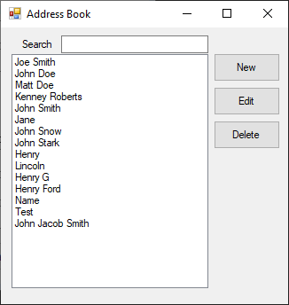
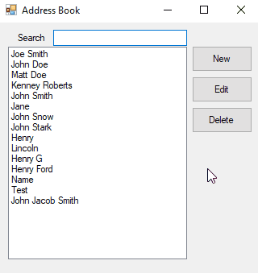
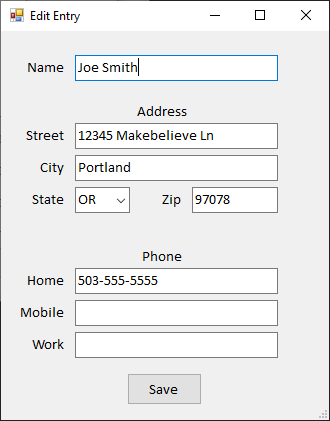

# Digital Address Book
Simple address book with a user interface to store name, address, and up to three phone numbers.

## Technologies
C#/.NET Framework v4.7.2

Dapper v2.1.15

Microsoft SQL Server 2022

## Features

Utilizing Windows Forms, this application has two different UI panes for viewing, adding, and editing address entries. Multiple entries can have the same address or phone number, but duplicate names are not allowed. Storage of the information is persistent across multiple loads of the application.

Allows for no-delay filtering of names in the address book via the Search box located on top of the main UI. Regularly cleans data in the database to remove information that is no longer being referenced by an address book entry.

## Approach

The logical structure of the application is simplified into three main areas:
* **Data Models**
  
  Three data models were used to store the logic of the three main classes. The main object class is a model of the address book entries. Inside this entry, there is also the address class model and the phone number class model.
* **Data Access**

  Although only a SQL connection is used, some future proofing was put into place by adding an interface for connecting to a data source. All calls to the database are done via the more generic interface allowing for a new data source other than the SQL server to be used without needing to modify any of the code. One data source considered was JSON storage. Data access is facilitated by the Dapper library.
* **UI**

  By utilizing C#/.NET framework, user interface implementation was streamlined via the Windows Forms creation tool in Visual Studio.

## Implementation
After doing some research on similar projects, I opted for a two-window implementation. The first window seen upon launching the program is the main window that automatically populates names fetched from the database. This window features a search box for filtering names in the event a lot of entries exist. This filtering happens "client-side", and does not need to connect to the SQL server after the initial fetching of names.

Example of filtering names:

The second window is a basic entry viewer/editor. Duplicate names are not allowed in the database and if the user were to create a new entry (or change an entry name to a different, already present name in the system) the user receives a warning that overwriting will occur. Upon saving an entry's information, a fresh call to the server is made to retrieve the names of all entries.

